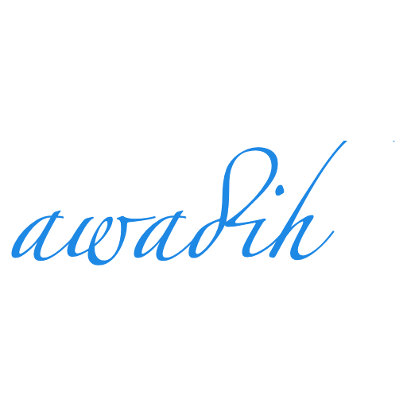

  

**Personal blog**

A brief portfolio about me!

# Welcome :relaxed:

Passionate for general knowledge, I post in this peronal blog my updated works in different fields. Besides my background in energy sciences & experience in data science, I am keen on working on volunteering projects.

## Academic context

Write differently from usual CV: narrate and focus on soft-skills. 

## Experience

Write differently from usual CV: narrate and focus on soft-skills. 

## Projects 

Write differently from usual CV: narrate and focus on soft-skills.

Use relative links for documentation of other projects:
[Doc for dx-Dash](dx-Dash/docs/development/1.current_location.md)

Some body text of this section.

Some text I want to provide a direct link to, but which doesn't have its own heading.

(… more content…)

[A link to that custom anchor](#my-custom-anchor-point)

## TODO

- [x] #739
- [ ] https://github.com/awadih
- [ ] Add delight to the experience when all tasks are complete :tada:

Text that is not a quote

> Text that is a quote

> [!NOTE]
> Useful information that users should know, even when skimming content.

> [!TIP]
> Helpful advice for doing things better or more easily.

> [!IMPORTANT]
> Key information users need to know to achieve their goal.

> [!WARNING]
> Urgent info that needs immediate user attention to avoid problems.

> [!CAUTION]
> Advises about risks or negative outcomes of certain actions.

