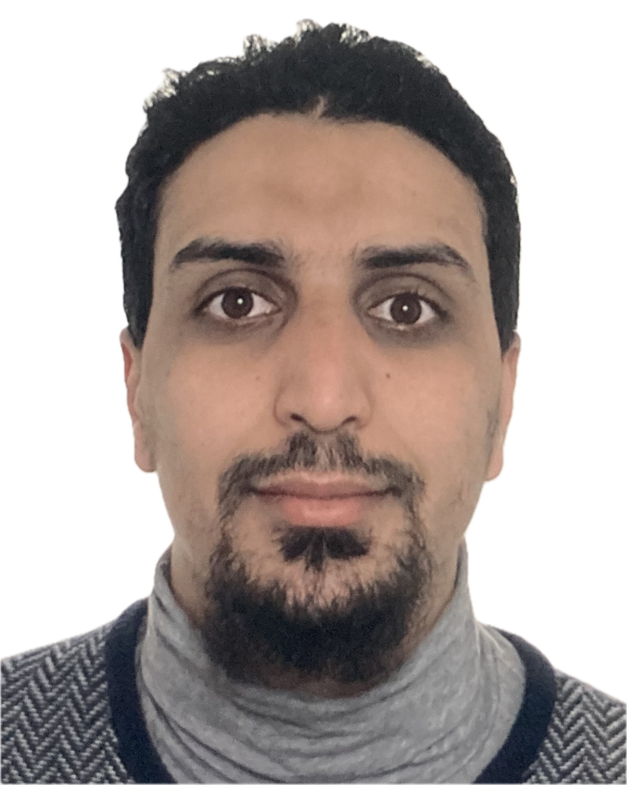

**Personal blog**

A brief portfolio about me!

# Welcome

Passionate for general knowledge, I post in this peronal blog my updated works in different fields, namely energy-related and data-driven projects. Besides my background in energy sciences & experience in data science, I am keen on working on volunteering projects.

## Academic context

Write differently from usual CV: narrate and focus on soft-skills.

#### Publications

#### Publications

## Experience

Write differently from usual CV: narrate and focus on soft-skills.

Adaptability and flexibility: traveling to Germany, Strong adaptability Capacity, differences between the job markts in Morocco & Germany

Data Science: data integration pipelines, data quality, data analysis

Teamwork and collaboration: Master scrum/Kanban (workflow management system) at Impuls Energy Trading GmbH, data engineer (API-Integration)

A self-reliant employee is one who can work independently, solve problems creatively, and deliver results efficiently without excessive reliance on others.
Control over tasks and processes, Emphasis on trust and empowerment at Deutsche Glassfaser GmbH: automation algorithms with VBA & Python.

## Projects

Write differently from usual CV: narrate and focus on soft-skills.

Leadership

---

> Please feel free to contact me for any remark. Happy to receive ideas and cooperate towards Projects for Good.
> 

<!-- COMMENT -->
